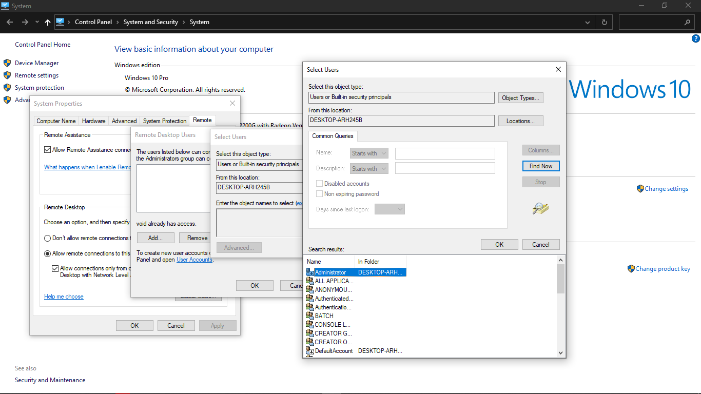

## RDPWrapper with AutoUpdater

	

### Instructions
- Open CMD in Administrator
- Run install.bat batch file
- Run update.bat batch file
- Run RDPConf.exe to check all the states are green.
- Add Remote User from Computer Properties -> Remote Settings -> Select Users -> Add 
- Finally run RDPCheck.exe to test the remote login.

### Original Repo RDPWrap
https://github.com/stascorp/rdpwrap
### Auto Updater Repo
https://github.com/asmtron/rdpwrap/blob/master/binary-download.md
